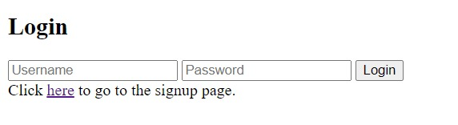
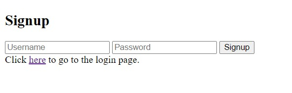
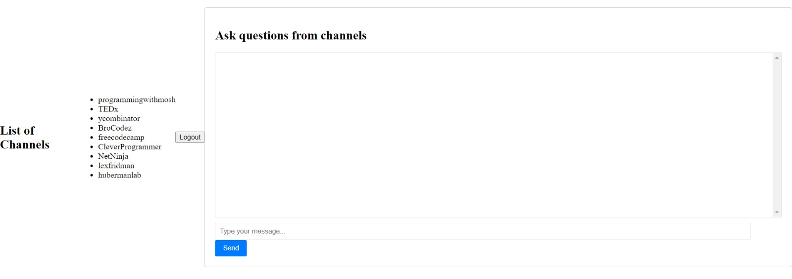
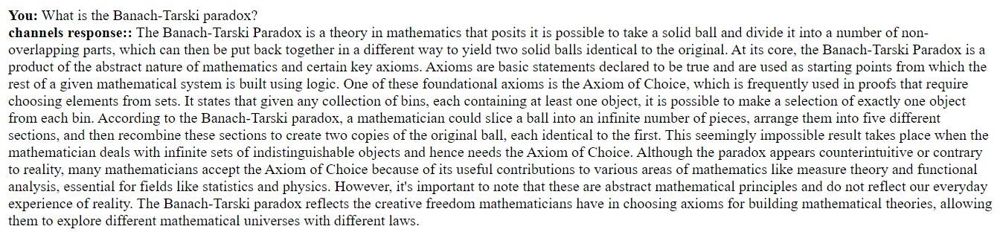
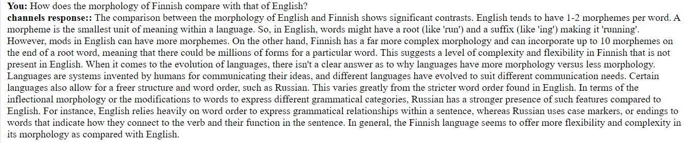
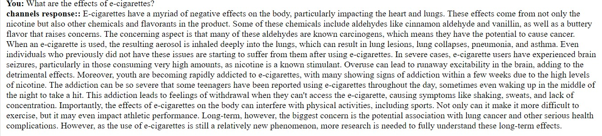
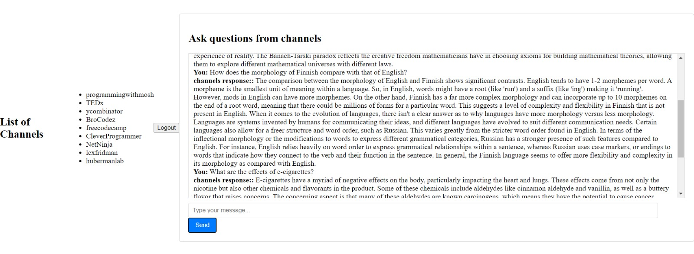

# YouTube-RAG-Search-Platform

## Overview
This project is a specialized search engine designed to enhance user engagement with YouTube's educational content. Videos from specific educational YouTube channels were used to create a vector database with ChromaDB. When a user queries, relevant chunks are fetched and sent to OpenAI API along with the original user query. The answer is displayed to the user, who can then further continue the conversation. 
By limiting the pool of knowledge of GPT to reliable sources of information, we ensure it provides accurate responses, which is vital for education. Further, the responses take into account the style and context of the specific channels.  

### For more details, please see the [Project Report](Project%20Report.pdf)

## Key Features
- **Specialized Educational Search**: Users can perform searches using natural language or keywords to find precise answers from curated educational YouTube channels.
- **Natural Language Processing**: Employs advanced NLP techniques to interpret user inquiries and match them with the most relevant video content.
- **Chat-based Interaction**: Simulates real-world conversations, allowing users to ask follow-up questions or seek detailed explanations as if interacting with a knowledgeable instructor.

## Technologies Used
- **Frontend**: React
- **Backend**: Flask, MongoDB
- **APIs**:
  - OpenAI API
  - YouTube Data API for fetching video transcripts (to prepare database)
- **Data Processing**:
  - OpenAI's `text-embedding-ada-002` model for generating embeddings
  - ChromaDB for storing high-dimensional vector data

## Implementation Details
The architecture is built on a microservices model, focusing on efficient data processing and retrieval:
- **Data Ingestion Service**: Manages the acquisition and analysis of YouTube video content.
- **Chunking and Embeddings Generation**: Processes video transcripts into manageable chunks and generates embeddings.
- **Query Handling Service**: Handles user queries by generating embeddings and performing similarity searches through ChromaDB.

## Setup and Installation
To set up and run this project locally, follow these steps:

# Clone the repository
git clone [repository-link]
# Navigate to the project directory
cd YouTube-RAG-Search-Platform
# Install dependencies
pip install -r requirements.txt
# Run the application
python app.py

## Usage
After setting up the project, users can interact with the platform through the web interface to ask questions and receive responses based on YouTube video content.

## Application Walkthrough

### Login Screen
*This is the login screen which allows an already registered user to log in using their credentials.*

### Signup Screen
*This is the signup screen which allows a new user to register.*

### Main Screen
*Once the user has successfully logged in, the user is redirected to the main screen. This screen shows the list of channels and a window where prompts can be written and answers will be displayed.*

### Prompt Examples
Here are three examples of prompts given to our model, demonstrating its functionality and integration with the frontend.

### Final Interaction Screen
*This screen captures the final interaction with our model, showcasing how it handles multiple prompts seamlessly.*

## Acknowledgments
Aaraiz Hassan - Frontend and Integration
Arooba Maqsood - Backend Development and Reporting
Ayza Shuja - Backend Development and Reporting
Bisma Nawaz - Backend Development and Presentation
M. Talha Tariq - Frontend Issues and Integration
Shaheer Akhtar - Backend Development and Integration
This project was developed as part of the course 'Generative AI' at LUMS University, Lahore under the guidance of our professor Dr. Agha Ali Raza. 

Reflections
Our journey through the development of VidHarbor was filled with learning and challenges. This project not only enhanced our technical skills but also taught us valuable lessons in teamwork and iterative development.
